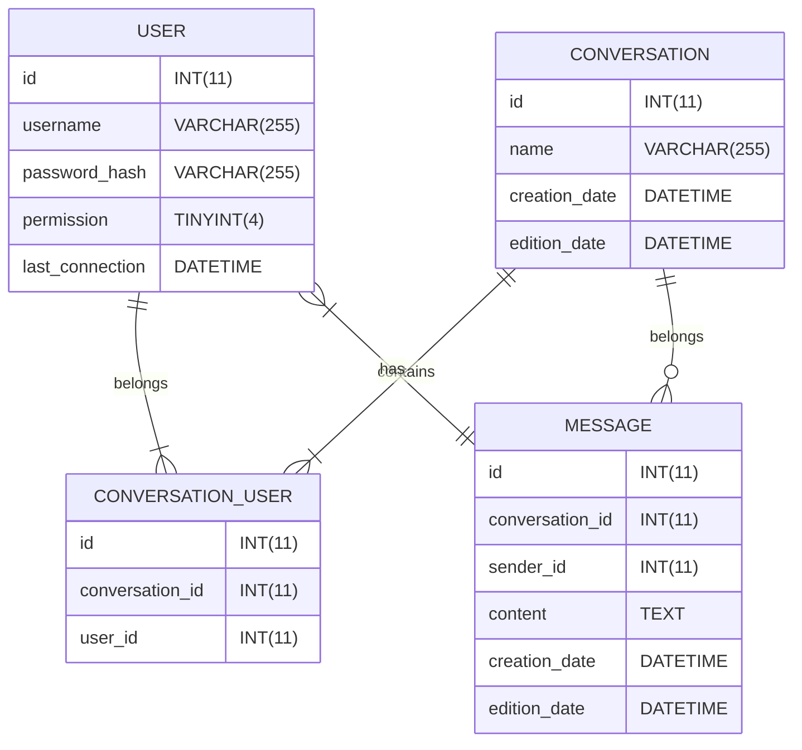

```mermaid
erDiagram
    USER {
        id INT(11) 
        username VARCHAR(255) 
        password_hash VARCHAR(255)
        permission TINYINT(4)
        last_connection DATETIME
    }
    CONVERSATION {
        id INT(11) 
        name VARCHAR(255)
        creation_date DATETIME
        edition_date DATETIME
    }
    CONVERSATION_USER {
        id INT(11) 
        conversation_id INT(11)
        user_id INT(11)
    }
    MESSAGE {
        id INT(11) 
        conversation_id INT(11)
        sender_id INT(11)
        content TEXT
        creation_date DATETIME
        edition_date DATETIME
    }
    USER ||--|{ CONVERSATION_USER : belongs
    CONVERSATION ||--|{ CONVERSATION_USER : contains
    CONVERSATION ||--o{ MESSAGE : belongs
    USER }|--|| MESSAGE : has
```